---

An agent tells you what it did. It might even believe it.

But the process that *acts* is the same one that *writes the report* — so the report is the one thing you can't use to check the act. You watch the wire instead.

The boundaries are set below where an agent can argue with them: guardrails enforced at the filesystem, not promised in a prompt. The watch runs one way — it sees out; nothing the agent does reaches back to bend it — and it is never told when it is being read. So there is nothing to deceive, and nothing to deceive *with*. Let it try to slip — a path it shouldn't take, a port it never uses, an hour off its schedule — and the metadata already holds it.

**[provable-observability](https://github.com/zzallirog/provable-observability)** is where that watch becomes continuous and falsifiable: every hour, the network asserts it is still observable. The rhythm is the proof; a broken rhythm is the alarm.
